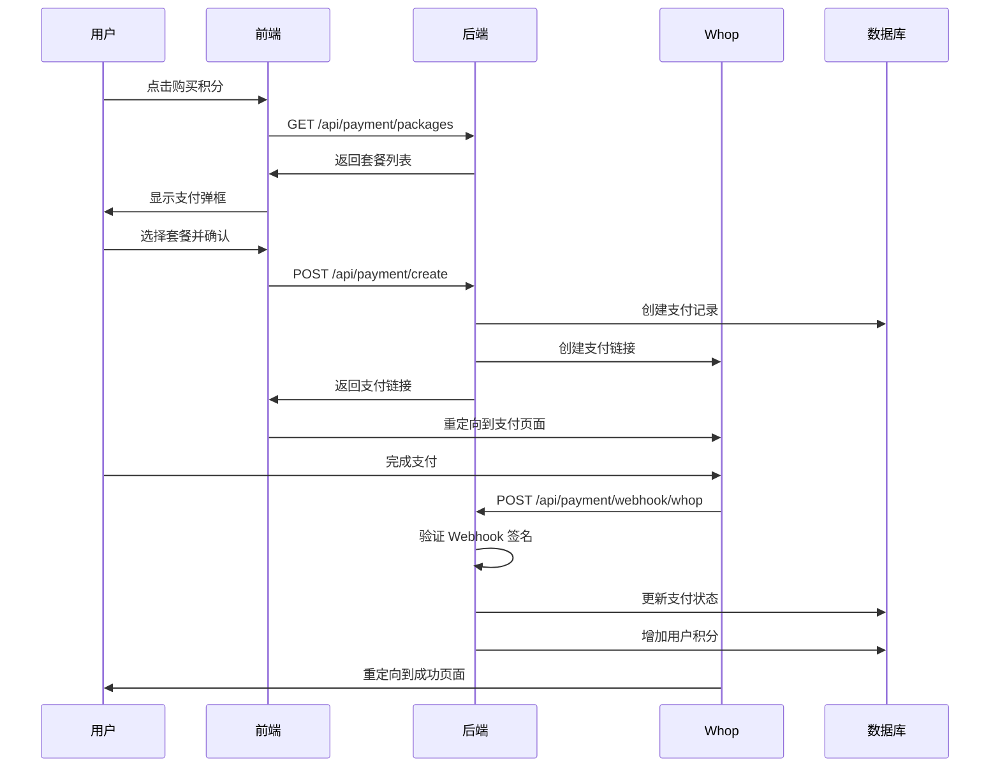

# Whop 支付集成指南

## 概述

本项目集成了 Whop 支付系统，用于处理积分购买功能。用户可以通过 Whop 支付购买积分，支付成功后系统会自动为用户账户充值相应的积分。

## 功能特性

- ✅ 多种积分套餐选择
- ✅ 安全的支付处理
- ✅ Webhook 回调验证
- ✅ 自动积分充值
- ✅ 支付历史记录
- ✅ 奖励积分系统

## 积分套餐

| 套餐 | 积分 | 价格 | 奖励 | 性价比 |
|------|------|------|------|--------|
| 基础包 | 100 | $1.00 | - | 1¢/积分 |
| 标准包 | 1000 | $10.00 | - | 1¢/积分 |
| 超值包 | 15000 | $100.00 | +5000 | 0.67¢/积分 |

## 集成步骤

### 1. Whop 账户设置

1. **注册 Whop 账户**
   - 访问 [Whop.com](https://whop.com)
   - 创建商家账户

2. **获取 API 密钥**
   - 登录 Whop Dashboard
   - 进入 Settings → API Keys
   - 复制 API Key 和 Webhook Secret

3. **配置 Webhook**
   - 在 Whop Dashboard 中设置 Webhook URL
   - URL: `https://your-api-domain.com/api/payment/webhook/whop`
   - 选择事件类型：
     - `payment.completed`
     - `checkout.completed`
     - `payment.failed`
     - `checkout.failed`

### 2. 环境变量配置

在 `.env` 文件中添加 Whop 配置：

```env
# Whop 支付配置
WHOP_API_KEY=your_whop_api_key_here
WHOP_WEBHOOK_SECRET=your_whop_webhook_secret_here
WHOP_COMPANY_ID=your_whop_company_id_here
```

### 3. Vercel 环境变量

在 Vercel Dashboard 中添加相同的环境变量：

1. 进入项目设置
2. 点击 "Environment Variables"
3. 添加以下变量：
   - `WHOP_API_KEY`
   - `WHOP_WEBHOOK_SECRET`
   - `WHOP_COMPANY_ID`

## 前端集成

### 1. 支付弹框组件

```tsx
import PaymentModal from './components/PaymentModal';

function App() {
  const [showPayment, setShowPayment] = useState(false);
  
  return (
    <div>
      <button onClick={() => setShowPayment(true)}>
        购买积分
      </button>
      
      <PaymentModal
        isOpen={showPayment}
        onClose={() => setShowPayment(false)}
        userEmail={user?.email}
        onPaymentSuccess={(credits) => {
          console.log('支付成功，获得积分:', credits);
          // 刷新用户积分显示
        }}
      />
    </div>
  );
}
```

### 2. 积分显示组件

```tsx
import { CreditsDisplay } from './components/CreditsDisplay';

function Header() {
  return (
    <div className="header">
      <CreditsDisplay />
    </div>
  );
}
```

## 支付流程

### 用户支付流程

1. **用户点击"购买积分"**
   - 显示支付弹框
   - 加载可用套餐

2. **选择套餐**
   - 用户选择积分套餐
   - 显示价格和积分数量

3. **创建支付订单**
   - 调用 `/api/payment/create` 接口
   - 获取 Whop 支付链接

4. **跳转到 Whop 支付**
   - 重定向到 Whop 支付页面
   - 用户完成支付

5. **支付完成处理**
   - Whop 发送 Webhook 通知
   - 系统验证支付并充值积分
   - 用户返回成功页面

### 技术流程



## API 接口

### 获取套餐列表
```http
GET /api/payment/packages
```

### 创建支付订单
```http
POST /api/payment/create
Authorization: Bearer <token>
Content-Type: application/json

{
  "packageId": "credits_1000",
  "successUrl": "https://yoursite.com/success",
  "cancelUrl": "https://yoursite.com/cancel"
}
```

### 支付历史
```http
GET /api/payment/user/history?limit=20
Authorization: Bearer <token>
```

## 安全措施

### 1. Webhook 签名验证

```typescript
function verifyWhopSignature(payload: string, signature: string): boolean {
  const crypto = require('crypto');
  const expectedSignature = crypto
    .createHmac('sha256', WHOP_CONFIG.WEBHOOK_SECRET)
    .update(payload)
    .digest('hex');
  
  return crypto.timingSafeEqual(
    Buffer.from(signature),
    Buffer.from(expectedSignature)
  );
}
```

### 2. 用户权限验证

- 支付订单只能由创建者查看
- 需要有效的 JWT Token
- 防止重复处理支付

### 3. 数据完整性

- 支付状态机制
- 事务性积分操作
- 详细的操作日志

## 测试

### 开发环境测试

1. **模拟支付完成**
   ```http
   POST /api/payment/test/complete/{paymentId}
   ```

2. **检查积分是否正确充值**
   ```http
   GET /api/credits/by-email/{email}
   ```

### 生产环境测试

1. **小额测试支付**
   - 使用最小套餐进行测试
   - 验证 Webhook 是否正常工作

2. **监控日志**
   - 查看 Vercel Functions 日志
   - 确认支付流程正常

## 故障排除

### 常见问题

1. **Webhook 未收到**
   - 检查 Whop Dashboard 中的 Webhook 配置
   - 确认 URL 可以公网访问
   - 检查 Webhook Secret 是否正确

2. **签名验证失败**
   - 确认 `WHOP_WEBHOOK_SECRET` 环境变量正确
   - 检查请求头中的签名格式

3. **积分未充值**
   - 查看支付记录状态
   - 检查数据库连接
   - 确认积分服务正常工作

### 调试工具

1. **查看支付记录**
   ```http
   GET /api/payment/{paymentId}
   ```

2. **查看积分交易**
   ```http
   GET /api/credits/transactions/{email}
   ```

3. **测试数据库连接**
   ```http
   GET /api/auth/test/db
   ```

## 监控和维护

### 关键指标

- 支付成功率
- Webhook 响应时间
- 积分充值准确性
- 用户支付转化率

### 日志监控

- 支付创建日志
- Webhook 处理日志
- 积分充值日志
- 错误和异常日志

### 定期检查

- 验证 Webhook 配置
- 检查环境变量
- 测试支付流程
- 备份支付数据

## 扩展功能

### 未来可能的改进

1. **多货币支持**
2. **订阅制支付**
3. **批量购买折扣**
4. **推荐奖励系统**
5. **支付分析报表**

---

## 联系支持

如果在集成过程中遇到问题，请：

1. 查看本文档的故障排除部分
2. 检查 Vercel 部署日志
3. 联系 Whop 技术支持
4. 提交 GitHub Issue